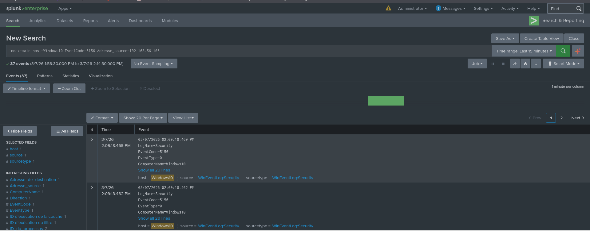

# Triage d'Alerte — Détection de Scan Réseau Nmap (Splunk / Windows Event Logs)

## Contexte

Ce writeup documente la détection et l'analyse d'un événement de reconnaissance réseau observé dans un environnement de lab contrôlé. Cet exercice est conçu pour pratiquer à la fois les techniques offensives et la surveillance défensive.

L'objectif ici n'est pas seulement de détecter le scan, mais de comprendre :

- Pourquoi cette activité génère des artefacts détectables
- Comment trier correctement une alerte à partir de logs Windows Event bruts
- Comment mapper le comportement observé au framework MITRE ATT&CK
- Quelles actions de réponse sont appropriées au regard des résultats


### Environnement

| Machine | Rôle | IP |
|---|---|---|
| Kali Linux | Attaquant | `192.168.56.106` |
| Windows 10 | Cible | `192.168.56.105` |
| Metasploitable | Cible secondaire | `192.168.56.108` |
| Purple Kali | Poste d'analyste SOC / SIEM Splunk | `192.168.56.104` |

**Stack de détection :**
- Splunk Enterprise — SIEM
- Windows Event Logs : Security, System, Application, Microsoft-Windows-Sysmon/Operational
- Audit des connexions de la plateforme de filtrage activé via `auditpol`

---

## Alerte Initiale

**Source :** Splunk — `WinEventLog:Security`  
**Horodatage :** 07/03/2026 à 14h09  
**Déclencheur :** Volume anormal d'événements `EventCode=5156` (Windows Filtering Platform — connexion autorisée) provenant d'une adresse IP interne inconnue.

**Requête SPL ayant fait remonter l'anomalie :**

```spl
index=main host=Windows10 EventCode=5156 OR EventCode=5157
```

---


## Investigation

### Étape 1 — Identification de la Source

Le premier événement a été développé et analysé :

```
EventCode        : 5156
Direction        : Inbound
Adresse source   : 192.168.56.106
Port source      : 947
Adresse dest     : 192.168.56.105
Port dest        : 445
Protocole        : 6 (TCP)
Processus        : System
Couche           : Receive/Accept
```

**Observation :** L'IP source `192.168.56.106` n'est pas la machine locale elle-même — c'est un hôte distinct sur le réseau interne qui initie des connexions entrantes vers W10. Cela exclut immédiatement l'activité loopback ou les processus système légitimes.


---

### Étape 2 — Analyse du Volume et des Ports



Pour isoler et profiler le trafic suspect, la requête SPL suivante a été exécutée :

```spl
index=main host=Windows10 EventCode=5156 Adresse_source=192.168.56.106
| stats count by Port_de_destination
| sort Port_de_destination
```

**Résultats :**
- **37 événements** générés en moins de 30 secondes
- Ports de destination observés : `135`, `139`, `445`, `947`, `49108` et un grand nombre de ports séquentiels
- Protocole : TCP exclusivement

**Timeline de l'attaque :**

```spl
index=main host=Windows10 EventCode=5156 Adresse_source=192.168.56.106
| timechart count
```

La timeline révèle une rafale d'activité concentrée sur une **fenêtre de 28 secondes** — un schéma caractéristique d'un outil automatisé plutôt que d'un comportement humain.


---


### Étape 3 — Corrélation avec d'autres EventCodes

Une recherche plus large a été exécutée pour identifier d'éventuels artefacts supplémentaires :

```spl
index=main host=Windows10 EventCode=4625 OR EventCode=4648
```


**EventCode 4648 détecté :** Une tentative de connexion avec credentials explicites a été observée ciblant les ports SMB (139/445). Cela est cohérent avec le flag `-sV` de Nmap, qui tente la détection de version de service en initiant des handshakes d'authentification partiels sur les ports ouverts découverts.

---

### Étape 4 — Identification de l'Outil

Les indicateurs suivants ont été collectés et corrélés avec les signatures de scan connues :

| Indicateur | Valeur observée | Interprétation |
|---|---|---|
| Ports contactés | 37+ en 28 secondes | Scan automatisé |
| Ports prioritaires | 135, 139, 445 | Énumération services Windows/SMB |
| Protocole | TCP SYN uniquement | Scan SYN furtif (`-sS`) |
| Processus côté cible | `System` | Gestion des connexions au niveau noyau |
| Source | IP unique `192.168.56.106` | Origine attaquant unique |

**Confirmé :** Le scan a été exécuté depuis AK14 avec la commande suivante :

```bash
nmap -sS -sV -p 1-1000 192.168.56.105
```

Durée totale du scan : 30,51 secondes — cohérent avec les horodatages observés dans Splunk.


---


## Mapping MITRE ATT&CK

Le comportement observé correspond aux techniques suivantes :

| Tactique | Technique | ID |
|---|---|---|
| Reconnaissance | Scan actif | T1595 |
| Découverte | Découverte de services réseau | T1046 |

**T1595 — Scan Actif :** L'attaquant a directement sondé l'infrastructure de la victime en envoyant des paquets TCP SYN sur une plage de ports, générant des artefacts réseau mesurables.

**T1046 — Découverte de Services Réseau :** L'attaquant a utilisé la détection de services de Nmap (`-sV`) pour identifier les logiciels fonctionnant sur les ports ouverts, collectant des informations pour préparer une exploitation potentielle.

**Services identifiés par le scan :**
- Port `135` → Microsoft Windows RPC
- Port `139` → Microsoft NetBIOS-SSN
- Port `445` → Microsoft-DS (SMB)

---


## Verdict

**VRAI POSITIF — Sévérité : MOYENNE**

| Critère | Évaluation |
|---|---|
| Source | IP interne `192.168.56.106` — non autorisée à effectuer des scans réseau |
| Comportement | 37 connexions TCP vers des ports distincts en 28 secondes |
| Schéma | 100% cohérent avec une signature de scan Nmap `-sS -sV` |
| Impact | Reconnaissance réseau — aucune exploitation détectée à ce stade |

---


## Réponse Recommandée

**Actions immédiates (Tier 1) :**
1. Isoler `192.168.56.106` du réseau dans l'attente d'une investigation
2. Escalader vers le Tier 2 avec ce rapport et les preuves de logs conservées
3. Conserver les logs Splunk pour la fenêtre temporelle concernée

**Actions à court terme (Tier 2) :**
4. Investiguer `192.168.56.106` pour détecter des signes de compromission ou d'utilisation non autorisée
5. Examiner les logs d'authentification sur W10 pour des tentatives d'exploitation post-scan
6. Déterminer si d'autres hôtes du réseau ont également été scannés

**Amélioration de la détection :**

L'alerte SPL suivante peut être déployée pour signaler automatiquement les futures activités de scan :

```spl
index=main EventCode=5156
| stats dc(Port_de_destination) as unique_ports by Adresse_source
| where unique_ports > 15
```

Cette alerte se déclenche quand une seule IP source contacte plus de 15 ports de destination distincts — une heuristique fiable pour la détection de scan automatisé.

---


## Règle de Détection Sigma

```yaml
title: Network Port Scan Detected via Windows Filtering Platform
id: a1b2c3d4-e5f6-7890-abcd-ef1234567890
status: experimental
description: >
  Detects automated network scanning based on an abnormal volume of inbound
  TCP connections from a single source to multiple distinct destination ports.
author: Xavier TOKO-PROUST
date: 2026/03/07
references:
  - https://attack.mitre.org/techniques/T1046/
  - https://attack.mitre.org/techniques/T1595/
tags:
  - attack.reconnaissance
  - attack.discovery
  - attack.t1595
  - attack.t1046
logsource:
  product: windows
  service: security
detection:
  selection:
    EventID: 5156
    Direction: Inbound
  condition: selection | count(DestPort) by SourceAddress > 15
falsepositives:
  - Authorized network monitoring tools (Zabbix, PRTG, Nessus)
  - Internal vulnerability scanners running scheduled assessments
level: medium
```

---


## Conclusion

Cet exercice démontre qu'un scan SYN Nmap standard laisse des traces claires et exploitables dans les Windows Event Logs, même sans outillage endpoint avancé. L'artefact `EventCode 5156` — généré par la Windows Filtering Platform — offre une visibilité fiable sur les tentatives de connexion entrantes lorsque la politique d'audit appropriée est activée.

Il met également en évidence un constat important : le mode de scan furtif `-sS` n'est pas furtif du point de vue de la journalisation hôte. Un défenseur avec l'audit `Filtering Platform Connection` activé et une alerte SPL basique détectera le scan dans les secondes qui suivent son exécution.

Une détection efficace ne nécessite pas toujours des outils complexes. Elle requiert les bonnes politiques d'audit, un pipeline de logs fonctionnel et une compréhension claire de ce à quoi ressemble le trafic normal.

---


*© Xavier TOKO-PROUST — [azar-security.site](https://azar-security.site)*
