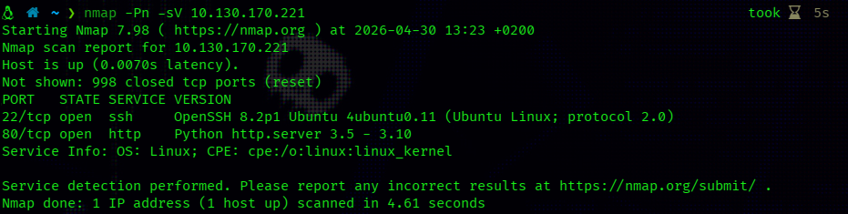
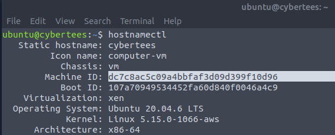
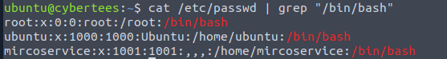
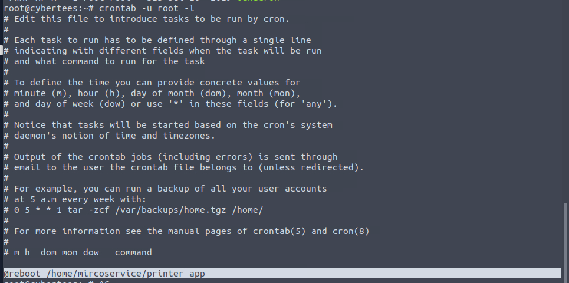
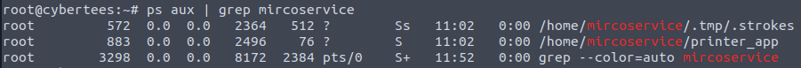
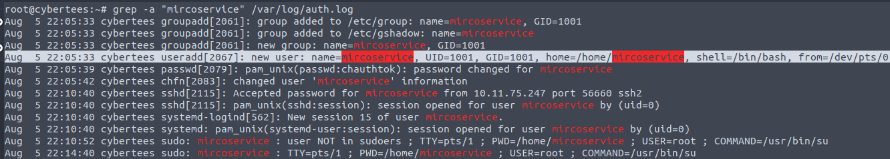
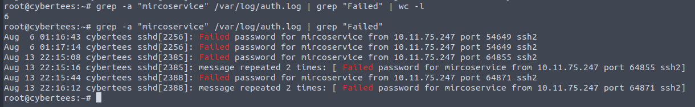
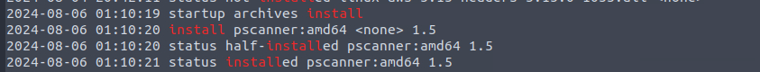
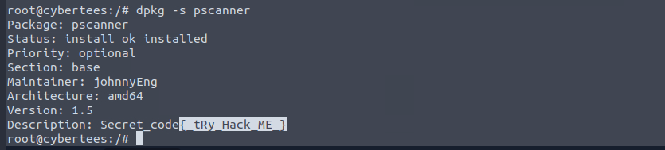

# IronShade — CTF Writeup

**Plateforme** : TryHackMe  
**Difficulté** : Moyenne  
**Catégorie** : Blue Team / Évaluation de Compromission

---

## Vue d'Ensemble

IronShade est un challenge blue team simulant une évaluation de compromission réelle. On vous donne un accès direct à un hôte Linux qui a déjà été compromis, et votre mission est de reconstruire ce qui s'est passé : qui est entré, comment, comment ils ont assuré leur persistance, et ce qu'ils ont laissé derrière eux.

---

## Reconnaissance

Même avec un accès direct à la machine, j'ai commencé par un scan `nmap` rapide pour avoir une vue d'ensemble de la surface d'attaque exposée :

```bash
nmap -sV <target_ip>
```



Le port HTTP était ouvert mais n'avait rien d'intéressant. Avant de plonger dans l'investigation, j'ai récupéré l'identité de la machine avec `hostnamectl`, qui est la méthode standard pour interroger ou modifier le hostname et l'identifiant machine d'un système Linux :

```bash
hostnamectl
```



---

## Identification de l'Empreinte de l'Attaquant

### Le Compte Backdoor

La première chose à chercher dans toute évaluation de compromission est la présence de comptes utilisateurs non autorisés. Sous Linux, tous les comptes sont dans `/etc/passwd`. Les comptes système légitimes utilisent `/usr/sbin/nologin` ou `/bin/false`, donc filtrer les vrais shells interactifs réduit rapidement les suspects :

```bash
cat /etc/passwd | grep "/bin/bash"
```



Un compte a immédiatement attiré l'attention : **`mircoservice`**. Un classique de l'attaquant — typosquatting d'un nom de service légitime (`mirco` au lieu de `micro`) pour se fondre dans le système et éviter de déclencher des alertes lors d'une revue rapide.

### Persistance via Cron

Avec le compte backdoor identifié, l'étape logique suivante était de vérifier comment l'attaquant avait assuré la survie de son accès après un redémarrage. J'ai d'abord vérifié le crontab de l'utilisateur — rien. Puis le crontab système et `/etc/cron.d/` — toujours rien d'alarmant. En revenant sur le crontab root plus attentivement, cette ligne se cachait en pleine vue :

```
@reboot /home/mircoservice/printer_app
```



La directive `@reboot` garantit que `printer_app` se lance automatiquement à chaque démarrage du serveur. Simple, efficace, et facile à rater si on ne lit pas attentivement.

### Processus en Cours & Artefacts Mémoire

Avec `printer_app` confirmé comme payload de persistance, j'ai tracé son exécution avec `ps` :

```bash
ps aux | grep mircoservice
```




### Services Malveillants

L'inspection des fichiers de service systemd a révélé deux entrées suspectes :

```bash
ls -la /etc/systemd/system/
```

**`backup.service`** et **`strokes.service`** n'avaient aucune raison légitime d'exister sur cet hôte. De plus, un service nommé **`.systmd`** était également présent — deux couches d'obfuscation en une : le point initial le cache des listings de répertoires standards sous Linux, et la faute de frappe (`systmd` vs `systemd`) est conçue pour usurper l'identité d'un composant système central au premier coup d'œil.

---

## Reconstruction de la Timeline d'Attaque

### Création du Compte

Avec le nom d'utilisateur de l'attaquant en main, j'ai remonté `/var/log/auth.log` pour trouver exactement quand le compte a été créé. Le flag `-a` est utile ici pour forcer grep à traiter les fichiers de log binaires comme du texte brut :

```bash
grep -a "mircoservice" /var/log/auth.log
```



L'entrée `new user` a confirmé que le compte a été créé le **5 août à 22:05:33**.

### Brute Force SSH

Le filtrage du même log pour l'activité SSH a révélé un schéma de connexions provenant d'une seule adresse IP — **`10.11.75.247`** :

```bash
grep -a "mircoservice" /var/log/auth.log | grep "Failed" | wc -l
```



**8** tentatives de connexion échouées ont été enregistrées sur le compte backdoor. Certains messages de log apparaissant en double, le comptage a nécessité un peu d'attention.

---

## Paquet Malveillant

Au-delà du compte et des mécanismes de persistance, l'attaquant a également installé un paquet malveillant sur l'hôte. La corrélation entre `/var/log/dpkg.log` et la timeline connue (compte créé le 5 août) a pointé directement vers **`pscanner`**, installé le 6 août :

```bash
grep "install" /var/log/dpkg.log
```



Le nom signifie vaguement *print scanner*, maintenant le thème consistant à imiter des logiciels aux noms légitimes. L'inspection de ses métadonnées avec `dpkg -s` a révélé quelque chose d'inattendu caché dans le champ `Description` :

```bash
dpkg -s pscanner
```



```
Package: pscanner
Maintainer: johnnyEng
Version: 1.5
Description: Secret_code{tRy_Hack_ME_}
```

Le code secret était là, en pleine vue : **`{tRy_Hack_ME_}`**.

---

## Points Clés

- Les attaquants s'appuient massivement sur le **typosquatting** — des noms d'utilisateurs et de services subtilement mal orthographiés (`mircoservice`, `systmd`) sont conçus pour passer une revue rapide sans éveiller de soupçons
- Les **entrées cron `@reboot`** sont l'un des mécanismes de persistance les plus simples disponibles, mais faciles à rater lors du parcours d'un crontab root chargé
- **osquery** est un outil puissant pour l'investigation forensique, particulièrement pour faire remonter des artefacts en mémoire qui n'apparaîtraient pas dans un scan de fichiers standard
- Construire une **timeline d'attaque** en corrélant les horodatages dans `auth.log`, `dpkg.log` et les fichiers de service systemd est essentiel pour comprendre la portée complète d'une compromission
- Des paquets malveillants peuvent cacher des données arbitraires dans les **champs de métadonnées** — ne jamais sauter le `dpkg -s` lors de l'investigation d'un logiciel inconnu
