# TryHackMe - Valenfind CTF Writeup

> **Room :** [Valenfind](https://tryhackme.com/room/lafb2026e10)
> **Difficulté :** Moyenne
> **Description :** "Love at first breach"


## Vue d'Ensemble

Rootons la room Valenfind sur TryHackMe. La room implique de l'énumération web, la découverte d'une vulnérabilité Local File Inclusion (LFI) via des commentaires frontend exposés, et l'exploitation d'une API admin pour exfiltrer la base de données.

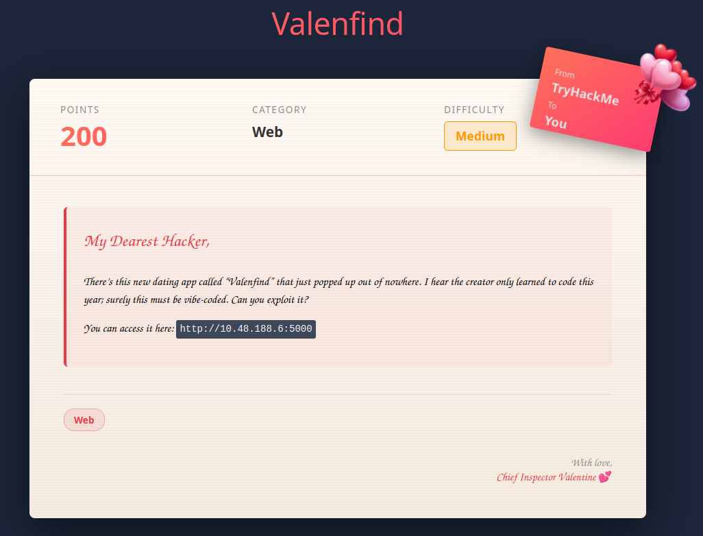

---

## Énumération

### Scan Nmap Initial

Commençons par le scan de ports pour identifier les services ouverts :

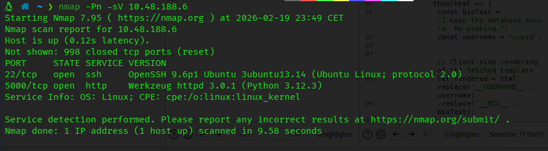

```bash
nmap -Pn -sV <TARGET IP>
```

**Résultats :**
- Port 22 : SSH (OpenSSH)
- Port 5000 : lié à HTTP (généralement utilisé par les applications web Python Flask) et un serveur Werkzeug httpd

Deux services actifs - commençons par investiguer l'application web sur le port 5000.

---

## Analyse de l'Application Web

### Découverte Initiale

En visitant `http://10.48.188.6:5000`, on découvre une application de rencontres appelée "Valenfind" :

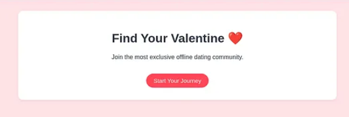

### Inscription

J'ai créé un compte pour explorer l'intérieur de l'application.

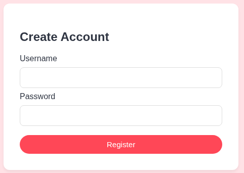

### Exploration du Dashboard

Après connexion, j'ai accès à un dashboard de profils :

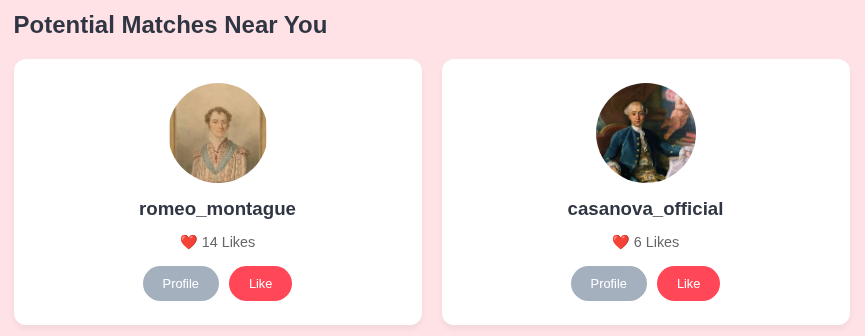

Plusieurs profils utilisateurs étaient visibles :
- `romeo_montague` (14 Likes)
- `casanova_official` (6 Likes)
- Et d'autres...

Un profil s'est immédiatement démarqué : **cupid** — vraisemblablement le compte admin ou système.


---

## Découverte de la Vulnérabilité LFI

### Interception des Requêtes avec Burp Suite

J'ai lancé Burp Suite pour analyser le comportement de l'application. En consultant les pages de profil, j'ai remarqué des requêtes vers `/profile/cupid`.

En inspectant la réponse de la page de profil, j'ai découvert un **commentaire JavaScript très intéressant** dans le code source :

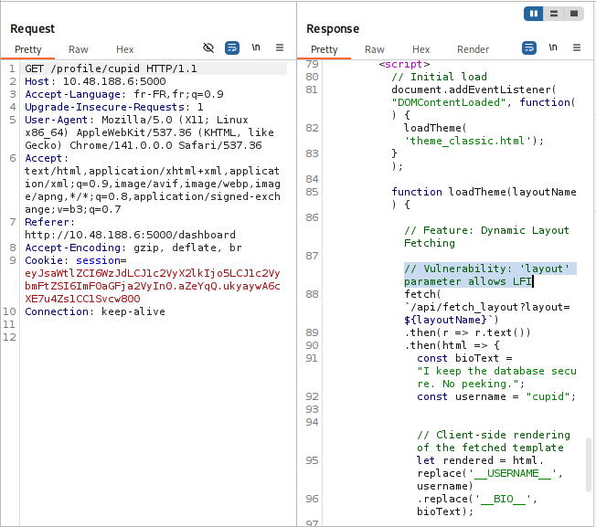

```JavaScript
// Feature: Dynamic Layout Fetching
// Vulnerability: 'layout' parameter allows LFI
fetch(`/api/fetch_layout?layout=${layoutName}`)
.then(r => r.text())
.then(html => {
const bioText = "I keep the database secure. No peeking.";
const username = "cupid";
```

**Jackpot !** Le développeur a littéralement laissé un commentaire indiquant *"Vulnerability: 'layout' parameter allows LFI"*.

La fonction `loadTheme()` est déclenchée à chaque changement de thème et envoie le paramètre `layout` vers `/api/fetch_layout`. C'est une vulnérabilité Local File Inclusion classique.


---

## Exploitation de la LFI

### Test de la Vulnérabilité

J'ai envoyé la requête dans Burp Repeater pour tester la LFI :

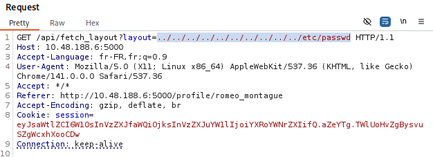


**Requête originale :**
```
GET /api/fetch_layout?layout=theme_classic.html HTTP/1.1
```

**Modifiée pour tester la LFI :**
```
GET /api/fetch_layout?layout=../../../../../../etc/passwd HTTP/1.1
```

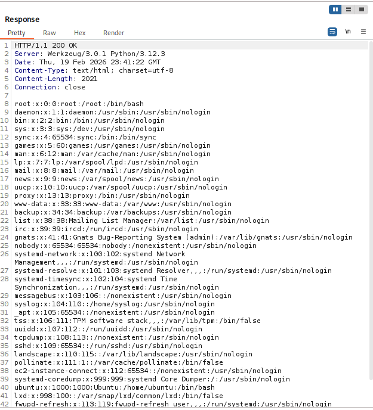

**Succès !** Le fichier `/etc/passwd` a été retourné, confirmant que la LFI fonctionne.


### Localisation du Chemin de l'Application

Pour lire le code source de l'application Flask, j'avais besoin de trouver son emplacement sur le système de fichiers. J'ai utilisé `/proc/self/cmdline` pour le découvrir :

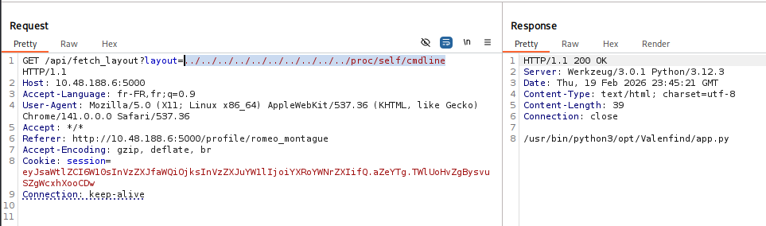

L'application est située dans `/opt/Valenfind/app.py`.


### Première Tentative (Échec)

J'ai tenté de lire le code source :

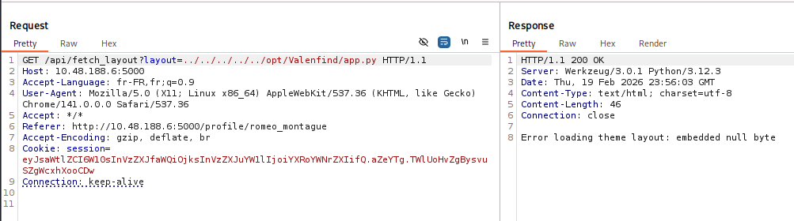

```
GET /api/fetch_layout?layout=/opt/Valenfind/app.py HTTP/1.1
```

**Réponse :**
```
Error loading theme layout: embedded null byte
```

### Le Problème du Null Byte

Le message d'erreur était déroutant au premier abord. Après investigation, j'ai réalisé qu'en copiant-collant le chemin depuis la réponse de `/proc/self/cmdline`, **un null byte avait été inclus** (les null bytes séparent les arguments dans cmdline).

J'ai vérifié la vue Hex dans Burp Suite et trouvé le null byte caché. Après l'avoir supprimé et retapé le chemin manuellement, la requête a fonctionné !

---

## Analyse du Code Source

### Informations Clés

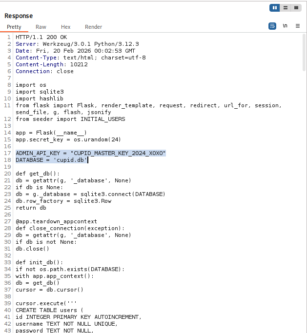

Le code source a révélé plusieurs informations critiques :

**1. Clé API Admin :**
```python
ADMIN_API_KEY = "CUPID_MASTER_KEY_2024_X0X0"
```

**2. Nom de la Base de Données :**
```python
DATABASE = 'cupid.db'
```

**3. Endpoint Admin Protégé :**

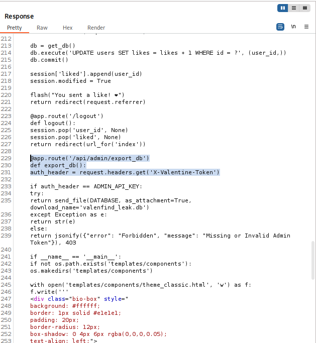

```python
@app.route('/api/admin/export_db')
def export_db():
    auth_header = request.headers.get('X-Valentine-Token')
    
    if auth_header == ADMIN_API_KEY:
        try:
            return send_file(DATABASE, as_attachment=True,
                           download_name='valenfind_leak.db')
        except Exception as e:
            return error()
    else:
        return jsonify({"error": "Forbidden", 
                       "message": "Missing or Invalid Admin Token"}), 403
```

Cette route nous permet de télécharger la base de données entière en fournissant le bon header `X-Valentine-Token` !

---


## Extraction de la Base de Données

### Utilisation de l'API Admin

Avec le token admin en main, j'ai utilisé curl pour télécharger la base de données :

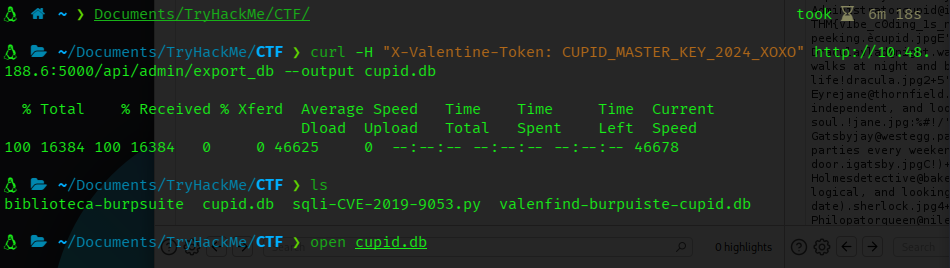

```bash
curl -H "X-Valentine-Token: CUPID_MASTER_KEY_2024_X0X0" \
  http://10.48.188.6:5000/api/admin/export_db \
  --output cupid.db
```

**Succès !** Le fichier de base de données a été téléchargé sous le nom `cupid.db`.

---


## Extraction du Flag

### Ouverture de la Base de Données

J'ai ouvert la base de données SQLite pour examiner son contenu :

```bash
sqlite3 cupid.db
```

### Localisation du Flag

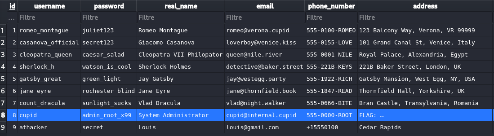

La table `users` contenait tous les comptes utilisateurs, dont le très convoité compte **cupid** :

| id | username | password | real_name | email | phone_number | address |
|----|----------|----------|-----------|-------|--------------|---------|
| 8 | cupid | admin_root_x99 | System Administrator | cupid@internal.cupid | 555-0000-ROOT | **FLAG: ...** |

**Flag Trouvé :** `THM{...}` (visible dans le champ adresse du compte cupid)


---


## Résumé de la Chaîne d'Attaque

1. **Énumération** → Découverte de l'application Flask sur le port 5000
2. **Inscription** → Création d'un compte pour accéder à l'application
3. **Découverte du Code Source** → Commentaire JavaScript révélant la vulnérabilité LFI
4. **Exploitation LFI** → Test avec `/etc/passwd`, confirmation de la vulnérabilité
5. **Localisation du Chemin** → Utilisation de `/proc/self/cmdline` pour trouver le chemin de l'application
6. **Extraction du Code Source** → Lecture de `app.py` via LFI pour découvrir les credentials admin
7. **Téléchargement de la Base de Données** → Utilisation de la clé API admin pour exporter la base SQLite
8. **Capture du Flag** → Extraction du flag depuis l'enregistrement de l'utilisateur cupid

---


## Points Clés

1. **Les Commentaires Développeur Peuvent Être Dangereux** — Le commentaire JavaScript nous a littéralement indiqué la vulnérabilité LFI. Ne jamais laisser de commentaires de debug dans le code de production !

2. **La LFI est Puissante** — Une fois la LFI obtenue, on peut souvent l'escalader en RCE ou divulgation de credentials en lisant des fichiers sensibles

3. **Les Null Bytes Sont Traîtres** — En travaillant avec `/proc/self/cmdline`, rappelons-nous que les arguments sont séparés par des null bytes. Toujours vérifier la vue hex si le copier-coller ne fonctionne pas

4. **Les Secrets Hardcodés = Mauvaise Pratique** — La clé API admin était hardcodée dans le code source. Les secrets doivent toujours être stockés dans des variables d'environnement ou des systèmes de gestion de secrets

5. **Défense en Profondeur** — Même si la LFI existait, une validation correcte des entrées et une sanitisation des chemins auraient pu empêcher l'exploitation


---

## Outils Utilisés

- `nmap` - Scan de ports et énumération des services
- `Burp Suite` - Interception et manipulation des requêtes
- `curl` - Interaction avec l'API et téléchargement de fichiers
- `sqlite3` - Inspection de la base de données

---

## Remédiation

Pour les développeurs et défenseurs :

1. **Validation des Entrées** : Ne jamais faire confiance aux entrées utilisateur. Utiliser des listes blanches de fichiers/chemins autorisés plutôt que d'essayer de blacklister les entrées malveillantes

2. **Supprimer les Commentaires de Debug** : Retirer tous les commentaires de debug et notes développeur avant le déploiement en production

3. **Gestion des Secrets** : Utiliser des variables d'environnement ou des solutions dédiées de gestion des secrets (HashiCorp Vault, AWS Secrets Manager, etc.)

4. **Principe du Moindre Privilège** : L'application web ne devrait pas avoir accès en lecture à des fichiers arbitraires sur le système de fichiers

5. **Content Security Policy** : Implémenter des headers CSP pour atténuer l'impact des vulnérabilités d'injection de code

---

*Writeup par **Azarkovich***

*Date : 20 février 2026*
